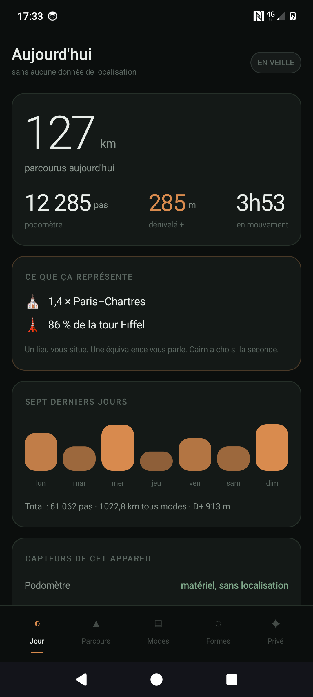
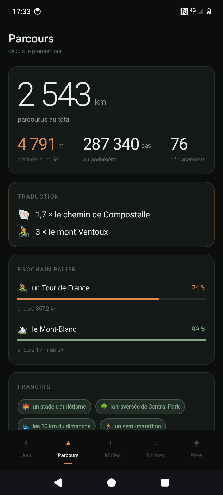
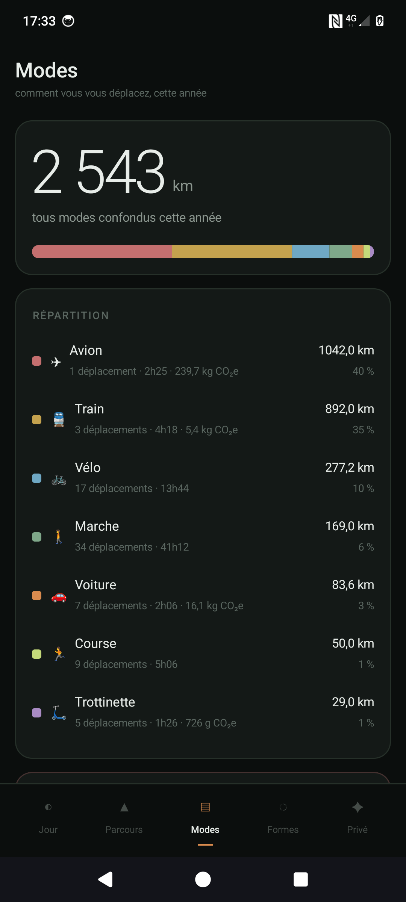
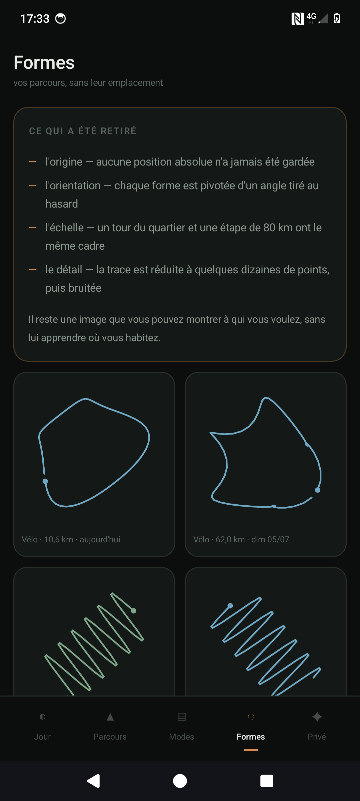
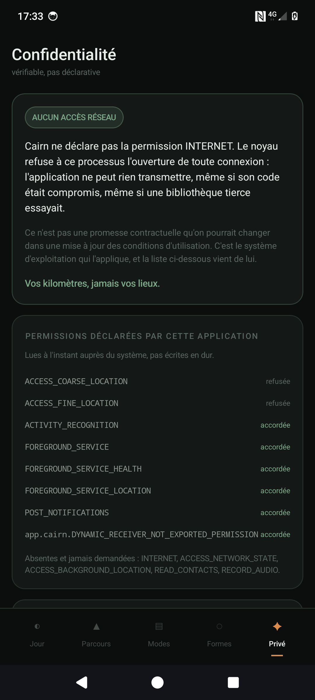

# Cairn

**Vos kilomètres, jamais vos lieux.**

Un traqueur d'activité pour Android qui compte vos pas, vos distances, votre
dénivelé et vos modes de déplacement — à pied, en courant, à vélo, en
trottinette, en voiture, en train, en avion — **sans jamais enregistrer où vous
êtes allé.**

Un cairn, c'est le tas de pierres qui balise un sentier de montagne. Il dit
« quelqu'un est passé » sans dire qui, ni exactement où.

| Jour | Parcours | Modes |
|:---:|:---:|:---:|
|  |  |  |

| Formes | Confidentialité |
|:---:|:---:|
|  |  |

*Captures prises avec un jeu de données de démonstration.*

---

## Le problème

Un traqueur GPS classique enregistre une liste de points. Cette liste est le
document le plus intime qu'un téléphone puisse produire : elle contient votre
domicile, votre lieu de travail, votre médecin, vos amis, vos horaires. Une fois
écrite sur le disque, elle peut fuiter, être revendue lors d'un rachat, être
exigée par une réquisition, ou simplement traîner dans une sauvegarde oubliée.

La plupart des applications répondent à ça par une politique de confidentialité.

Cairn répond par une architecture.

## Les quatre garanties

### 1. L'application n'a pas accès au réseau

Cairn ne déclare pas la permission `INTERNET`. Le noyau Linux d'Android refuse
alors au processus l'ouverture de toute socket. Ce n'est pas une promesse
contractuelle qu'une mise à jour des conditions d'utilisation pourrait défaire :
**c'est le système d'exploitation qui l'applique.** L'application ne *peut pas*
transmettre quoi que ce soit — même si son code était compromis, même si une
dépendance tierce essayait.

Vérifiable en cinq secondes :

```bash
aapt dump permissions cairn.apk
```

Aucune ligne `INTERNET`, aucune ligne `ACCESS_NETWORK_STATE`.

### 2. Les positions n'atteignent jamais le disque

Le GPS est optionnel, désactivé par défaut, et sert uniquement à mesurer la
distance d'un véhicule — là où le podomètre ne peut rien faire.

Regardez [`EphemeralDistance.kt`](app/src/main/kotlin/app/cairn/sensing/EphemeralDistance.kt).
L'état complet de cette classe tient en trois nombres : la latitude, la
longitude et l'horodatage du point **précédent**. Pas de `List`, pas de `Array`,
pas de tampon, pas de fichier temporaire. À chaque position reçue, on calcule
l'écart avec le point précédent, on l'ajoute à un compteur, et on écrase.

Ce qui survit à un trajet de 40 km : le nombre `40000`. Rien d'autre.

Ce n'est pas une politique de rétention — c'est une impossibilité structurelle.
Enregistrer une trace exigerait de réécrire cette classe, ce qui se verrait dans
le diff.

### 3. Le registre de transparence

Toutes les applications disent respecter votre vie privée. Aucune ne vous montre
la liste exhaustive de ce qu'elle a écrit sur votre disque.

Cairn consigne **chaque écriture et chaque capteur ouvert** dans un registre
consultable depuis l'écran Confidentialité. Effet de bord intéressant : il
devient impossible d'ajouter discrètement une collecte, puisqu'elle apparaîtrait
dans le registre de tous les utilisateurs.

### 4. Aucune sauvegarde automatique

`allowBackup="false"` et des règles d'extraction qui excluent tout. Vos données
ne partent ni sur Google Drive, ni via le transfert d'appareil à appareil. Le
seul moyen de les déplacer est un export manuel et explicite, en JSON lisible.

---

## Ce que ça donne à l'usage

Sans carte à afficher, il fallait autre chose. Cairn traduit les chiffres en
**équivalences** :

> 412 km ce mois-ci, soit 1,1 × Paris–Lyon
> D+ 4 812 m, soit 1 × le Mont-Blanc depuis le niveau de la mer
> 0,9 % du tour de la Terre depuis le début

Vous n'êtes jamais allé à Lyon. C'est bien le principe : une équivalence vous
parle sans vous situer.

### Les formes

Si vous activez le GPS, Cairn peut garder le **dessin** d'un parcours — et
seulement le dessin. La trace est recentrée sur une origine arbitraire, pivotée
d'un angle tiré au hasard, ramenée à une boîte unitaire (donc privée d'échelle),
simplifiée à quelques dizaines de points et légèrement bruitée.

Il reste une image partageable. Il ne reste rien de recalable sur une carte.

### La reconnaissance des modes

Entièrement sur l'appareil, sans Google Play Services (qui introduirait une
bibliothèque tierce disposant du réseau dans le processus), et **sans boîte
noire** : le classifieur est un jeu de règles lisibles, et chaque verdict
s'affiche avec sa justification en français.

| Mode | Ce qui le trahit |
|---|---|
| Marche / course | la cadence du podomètre |
| Vélo | une oscillation de 0,7 à 2,2 Hz — le coup de pédale |
| Trottinette | la même vitesse, sans oscillation, avec les vibrations hautes de petites roues |
| Train | vitesse quasi constante, aucun arrêt, très peu de vibrations |
| Voiture | vite, et à l'arrêt une bonne partie du temps |
| Avion | une chute de pression de plusieurs hPa par minute — signature d'une cabine pressurisée, détectable **sans GPS** |

Le baromètre est le capteur préféré du projet : plus précis que le GPS en
altitude (±1 m contre ±10 m), et incapable par nature de révéler une position.
La fonction « montagne » est donc à la fois la plus juste et la moins bavarde.

---

## Installation et mises à jour

Cairn ne peut pas vérifier lui-même l'existence d'une nouvelle version : cela
demanderait un accès réseau, donc de renoncer à la garantie n° 1.

C'est le **gestionnaire de paquets** qui s'en charge — lui a le réseau, pas nous.

### Obtainium (recommandé)

1. Installez [Obtainium](https://github.com/ImranR98/Obtainium/releases)
2. « Ajouter une application » → collez l'URL de ce dépôt
3. Activez les notifications de mise à jour

À chaque publication, Obtainium vous notifie et propose l'installation. Le
résultat est identique à une mise à jour intégrée ; la différence est que
l'application qui compte vos pas n'a toujours aucun moyen de parler à
l'extérieur.

### Manuellement

Téléchargez l'APK depuis la page [Releases](../../releases).

---

## Compiler

```bash
git clone https://github.com/micferna/cairn.git
cd cairn
./gradlew assembleDebug
```

Prérequis : JDK 17, Android SDK (`platforms;android-37.1`).

### Qualité

```bash
./gradlew detekt lintDebug lintRelease
```

- **detekt** — code mort, doublons, complexité, bugs latents. `build.maxIssues = 0`
  et **aucune règle n'est désactivée** dans [`config/detekt.yml`](config/detekt.yml) :
  quand l'analyse signale quelque chose, on corrige le code, on ne fait pas
  taire la règle.
- **Android Lint** — `warningsAsErrors = true`, sur les variantes debug *et*
  release. Couvre les API dépréciées, les fuites, les ressources inutilisées et
  les défauts de sécurité.
- **CodeQL** — analyse de flux hebdomadaire, requêtes `security-extended`.
- **Dependabot** — surveille les CVE et propose les montées de version.

La CI rejoue tout cela sur chaque push, **et vérifie sur l'APK compilé
qu'aucune permission réseau n'est apparue.** La garantie centrale du projet est
donc testée à chaque commit, pas seulement affirmée ici.

### Versions

Le projet vise systématiquement les dernières versions stables — aucune alpha,
beta ou RC. Au moment d'écrire ces lignes : Gradle 9.6.1, AGP 9.3.1,
Kotlin 2.4.10 (support intégré à AGP, sans plugin séparé), Compose BOM
2026.06.01, compileSdk et targetSdk 37, minSdk 26.

### Dépendances

La liste complète, volontairement minimale :

```
androidx.core:core-ktx
androidx.activity:activity-compose
androidx.lifecycle:lifecycle-runtime-ktx
androidx.lifecycle:lifecycle-viewmodel-compose
androidx.compose:*  (BOM)
org.jetbrains.kotlin:kotlin-stdlib
```

Aucun SDK d'analyse, aucun client HTTP, aucun Play Services, aucune génération
de code. La base SQLite est écrite à la main — pas par choix esthétique, mais
pour que n'importe qui puisse lire l'intégralité du schéma en une minute et
constater qu'aucune colonne ne peut contenir une position.

---

## Limites connues

- **Android uniquement** pour l'instant.
- **Le dénivelé exige un baromètre.** Les téléphones d'entrée de gamme n'en ont
  pas. Cairn le détecte, le dit franchement, et refuse d'estimer une altitude à
  partir du GPS — ce serait à la fois imprécis et bavard.
- **Sans GPS, les modes en véhicule ne sont pas mesurés en distance.** C'est un
  arbitrage assumé : la marche et la course fonctionnent parfaitement sans jamais
  demander la moindre permission de localisation.
- Le classifieur est réglé sur des seuils raisonnables mais non validés à grande
  échelle. Les corrections manuelles ne sont pas encore implémentées.

## Licence

GPL-3.0. Voir [LICENSE](LICENSE).

Le copyleft est un choix cohérent avec le reste : il empêche qu'une version
fermée du même code réintroduise silencieusement ce que ce projet a retiré.
